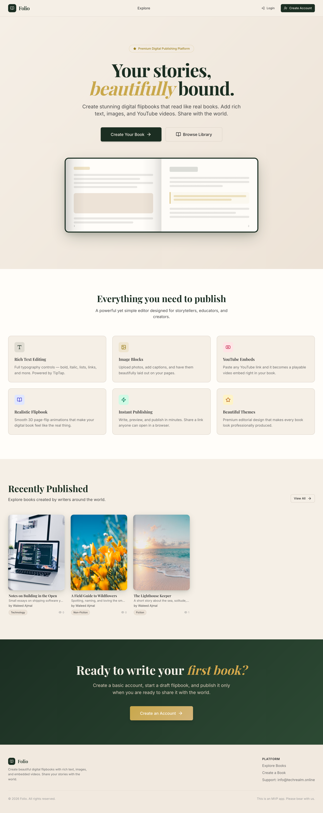
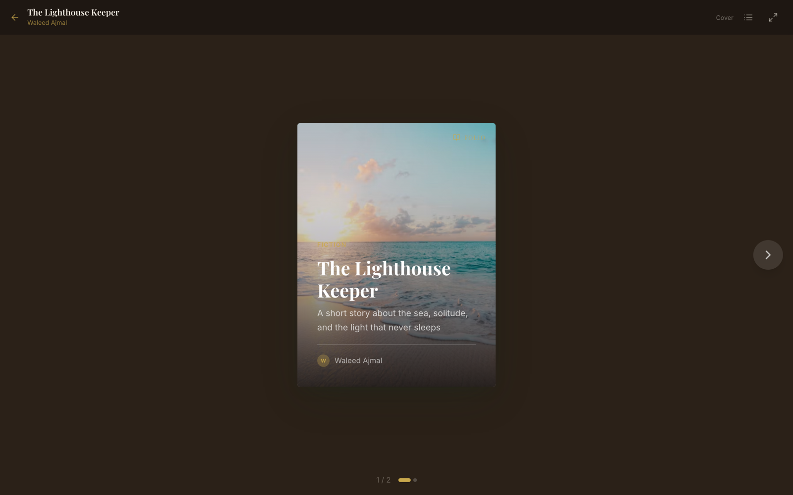
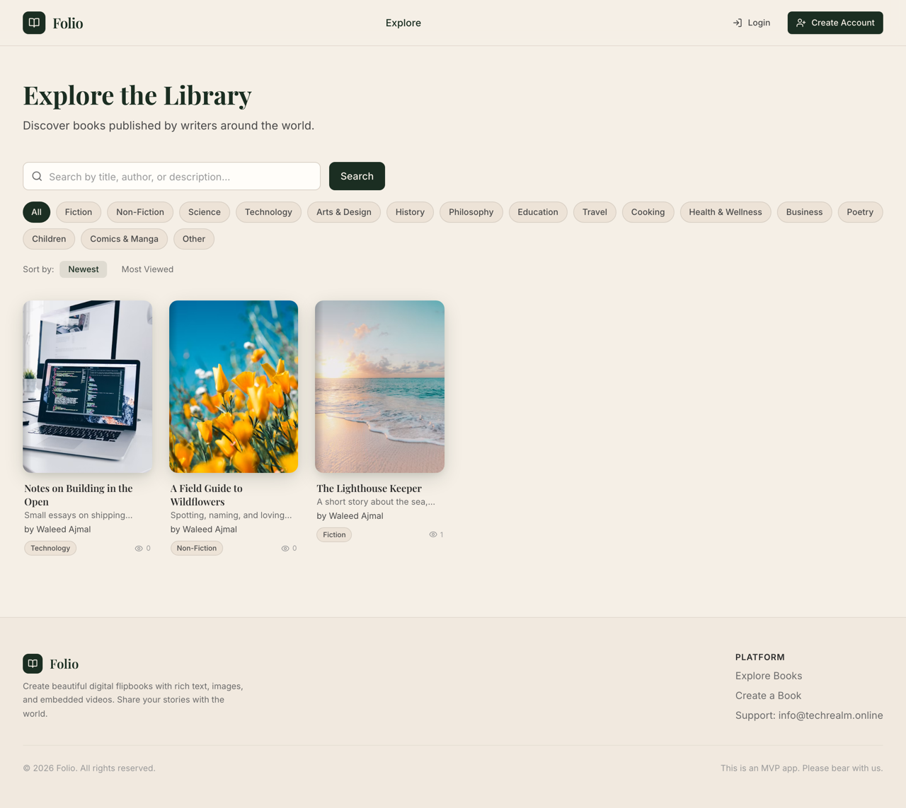
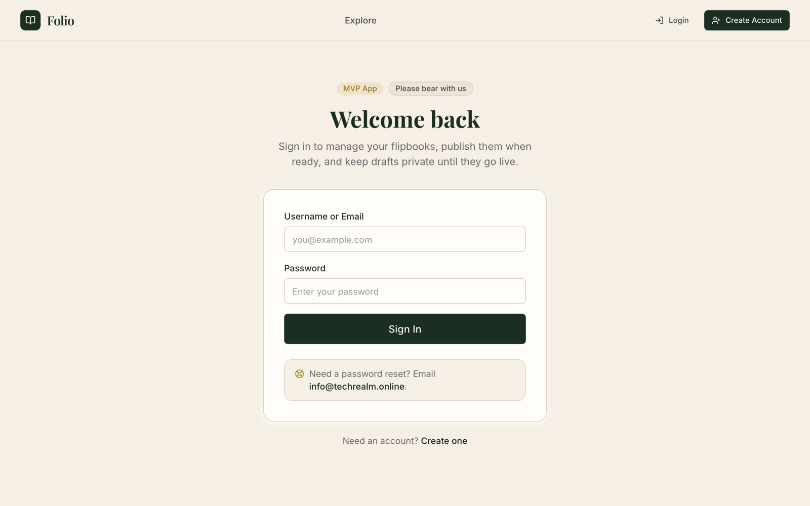
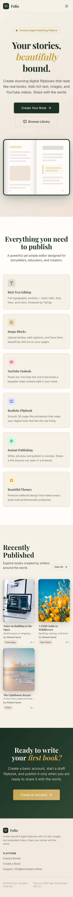
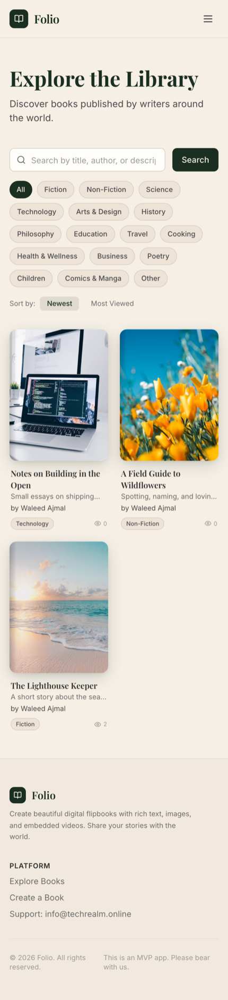

<div align="center">

# 📖 Folio

### Your stories, *beautifully* bound.

Folio turns the browser into a bookshelf. Write rich text, drop in images and
YouTube videos, arrange it into pages — and read it back as a real, 3D
page-flipping book you can share with a single link.

_A full-stack digital flipbook studio: Next.js 15 on the front, FastAPI on the back,
and not a database server in sight._



</div>

---

## ✨ What makes it cool

- **A book that actually feels like a book.** Smooth 3D page-flip animations, a
  cover, a spine shadow, page numbers — the works. Reading a Folio isn't scrolling,
  it's turning pages.
- **A proper block editor.** Rich text (powered by TipTap), headings, images with
  captions, pull-quotes, dividers, and live YouTube embeds — dragged and dropped
  into place with `@dnd-kit`.
- **Draft → publish flow.** Keep books private while you tinker, then publish when
  they're ready. Share a clean `/read/your-slug` link with the world.
- **Zero-database storage.** Everything lives in tidy CSV files under `/data`, and
  uploads land in `/public/uploads`. Clone it, run it, done — no Postgres, no Redis,
  no Docker-compose incantations.
- **Salted password hashing.** Accounts use PBKDF2-SHA256 with per-user salts.
  (Yes, even the "no database" app takes your password seriously.)
- **Editorial by default.** Playfair Display + Inter, a warm cream-and-forest
  palette, and layouts that make every book look professionally produced.

<div align="center">


_The reader: a real cover, real page turns, real charm._

</div>

---

## 🧱 How it's built

Folio is two small apps that hold hands:

| Layer        | Stack                                                        | Job                                                   |
| ------------ | ----------------------------------------------------------- | ----------------------------------------------------- |
| **Frontend** | Next.js 15 (App Router, React 19), Tailwind CSS, TipTap      | The UI, the editor, the flipbook reader               |
| **Backend**  | FastAPI + pandas                                            | A tiny JSON API over CSV "tables" (books/pages/blocks)|
| **Storage**  | CSV files in `/data`, images in `/public/uploads`           | State, without a database to babysit                  |

The Next.js server components call the FastAPI backend (default `http://127.0.0.1:8002`)
for every piece of data. Auth is a simple session-token flow stored in an httpOnly cookie.

---

## 🚀 Quick start (beginner-friendly, nothing assumed)

You'll run **two** things: the Python backend and the Next.js frontend. Two terminals, two commands each. Let's go.

### 0. Prerequisites

Make sure these are installed:

- **Node.js 18.18+** (20 or 22 recommended) — check with `node -v`
- **Python 3.10+** — check with `python3 --version`
- **npm** (comes with Node) — check with `npm -v`

### 1. Grab the code

```bash
git clone https://github.com/waleedsworld/ebookhroon.git
cd ebookhroon
```

### 2. Set up your environment file

```bash
cp .env.example .env.local
```

The defaults already point the frontend at the local backend, so you don't need
to change anything to run locally.

### 3. Start the backend (Terminal 1)

```bash
# create an isolated Python environment
python3 -m venv .venv
source .venv/bin/activate          # Windows: .venv\Scripts\activate

# install the backend's dependencies
pip install -r backend/requirements.txt

# run the API on port 8002
python -m uvicorn backend.main:app --reload --port 8002
```

You should see `Uvicorn running on http://127.0.0.1:8002`. Visit
[http://127.0.0.1:8002/health](http://127.0.0.1:8002/health) and you'll get
`{"status":"ok"}`. Interactive API docs live at `/docs`.

### 4. Start the frontend (Terminal 2)

```bash
npm install
npm run dev
```

Open **[http://localhost:3000](http://localhost:3000)** and you're in. 🎉

The repo ships with a few **demo books** already seeded in `/data`, so the shelf
isn't empty on your first visit. Head to **Explore** to read them, or **Create
Account → Create Your Book** to make your own.

> **Tip:** the very first account you register becomes the `admin`. After that,
> everyone else is a regular `user`.

---

## 🗺️ A tour of the app

<div align="center">

| Explore the library | Sign in |
| :---: | :---: |
|  |  |

</div>

- `/` — the landing page and freshly published books
- `/explore` — browse and filter the public library
- `/read/[slug]` — the flipbook reader
- `/create` — start a new book
- `/edit/[bookId]` — the block editor
- `/dashboard` — your own books (drafts + published)

---

## 📱 Looks good on your phone, too

Folio is responsive top to bottom — the shelf, the editor, and the reader all
adapt to small screens.

<div align="center">

| Home (mobile) | Explore (mobile) |
| :---: | :---: |
|  |  |

</div>

---

## 🛠️ Scripts

| Command             | What it does                                    |
| ------------------- | ----------------------------------------------- |
| `npm run dev`       | Start the Next.js dev server (hot reload)       |
| `npm run build`     | Production build                                |
| `npm run start`     | Serve the production build                      |
| `npm run lint`      | Lint the frontend                               |
| `npm run api:dev`   | Start the FastAPI backend with reload (port 8002) |

---

## 📂 Project structure

```
ebookhroon/
├── backend/            # FastAPI app — the CSV-backed JSON API
│   ├── main.py         #   all routes: auth, books, pages, blocks, uploads
│   └── requirements.txt
├── data/               # CSV "tables" (demo seed data lives here)
│   ├── books.csv
│   ├── pages.csv
│   └── blocks.csv
├── docs/media/         # README screenshots
├── public/uploads/     # uploaded images (gitignored, kept with .gitkeep)
└── src/
    ├── app/            # Next.js App Router pages + API routes
    ├── components/     # editor blocks, marketing, reader, UI kit
    ├── lib/            # server actions, auth, backend client, utils
    └── types/          # shared TypeScript types
```

---

## 🔐 A note on data & auth

Folio is intentionally a lightweight, no-database **MVP**. Data is stored in flat
CSV files and passwords are salted + hashed (PBKDF2-SHA256). It's perfect for
demos, personal libraries, and small deployments — for a high-traffic production
setup you'd want to swap the CSV layer for a real database. The seam is small:
it all lives in `backend/main.py`.

---

## 🌐 Live demo

**Deploying soon.** ⏳ (Folio needs both the Next.js frontend and the FastAPI
backend running, so the live link is on its way.)

---

## 💛 Made with care

Folio started as a weekend "could a book feel like a *book* in the browser?"
experiment and kept growing from there. If you build something lovely with it,
that's the whole point — go bind some stories.
